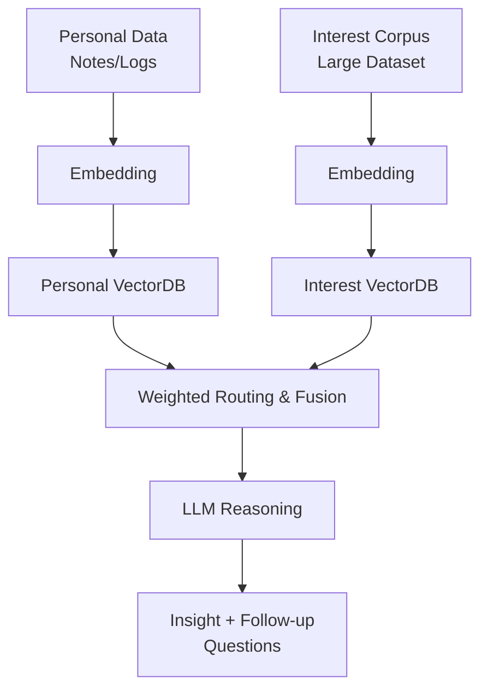

# 🧠 Second Brain
> **내 기록을 기반으로 사고를 확장하고, 나와 대화하는 두 번째 두뇌**  
> *Your data, your reflective Second Brain.*

## 📌 프로젝트 개요
**Second Brain**은 사용자의 개인 기록과 관심사 기반 데이터셋을 결합하여  
생각을 되묻고, 패턴을 찾아내며, 사고를 확장하도록 돕는 **개인 사고 조력 AI 시스템**입니다.

> 목표는 단순한 정보 제공이 아닌  
> **나와 대화하는 또 하나의 두뇌(Second Brain)** 를 만드는 것입니다.

## ✨ 핵심 기능

| 기능 | 설명 |
|---|---|
🧠 Personal RAG | 개인 노트·일기·기록 기반 지식/사고 회상  
🌐 Interest RAG | 관심 분야 데이터셋 기반 확장 검색  
🎛️ Hybrid Retrieval | 개인/관심사 DB 자동 라우팅 및 스코어 융합  
💬 Reflection Engine | 통찰 질문 & 사고 확장 대화  
🔍 근거 기반 응답 | 문서 기반 근거 인용 (Hallucination 억제)  
🔐 Privacy | 개인 데이터 독립 저장 및 보호  

## 🧠 왜 필요한가?

- 우리는 **기록은 쌓지만 활용되지 않는다**
- AI는 똑똑하지만 **나를 모른다**
- 자기 성찰/메타인지가 중요하지만 **습관화가 어렵다**

> Second Brain은 기록 → 성찰 → 질문 → 개선  
> **지속적인 사고 루프(Self-Improvement Loop)** 를 만든다.

## 🧩 시스템 구조



## 📂 데이터 예시

### Personal Document
```json
{
  "source": "obsidian",
  "text": "최근 집중력이 떨어진다. 원인은 수면 부족으로 보인다.",
  "date": "2025-10-31",
  "tags": ["reflection", "productivity"],
  "sentiment": "neutral"
}
```

### Interest Dataset Metadata
```json
{
  "source": "wikipedia_ai",
  "topic": "machine_learning",
  "tokens": 5800000
}
```

## ⚙️ 기술 스택

| 구성 | 기술 |
|---|---|
LLM | GPT / Local LLM  
Embedding | bge-m3 / OpenAI  
Vector DB | Chroma / FAISS  
Framework | FastAPI / Python  
Data | Markdown, PDF, YouTube CC  
Storage | Local secure namespace  

## ✅ 평가 기준

| 항목 | 지표 |
|---|---|
Retrieval | Recall@k, Citation accuracy  
Personalization | Personal relevance score  
Ablation | Personal vs Interest vs Hybrid 비교  
Latency | p95 latency  
Reflection Quality | Question depth & coherence  

## 🚀 MVP 목표 (1–2주)

- 개인 기록 ingest + 쿼리 가능
- 관심사 데이터셋 구축 및 결합 검색
- 라우팅 전략 + 점수 가중
- **통찰 질문 3개 + 근거 인용 응답** 출력

## 💡 예시 대화

**User:**  
요즘 공부 루틴이 계속 깨져. 이유가 뭐지?

**Second Brain:**  
최근 기록에서 “피로”와 “목표 과부하” 패턴이 반복됩니다.

**질문:**  
- 목표가 너무 큰 건 아닐까?  
- 에너지 높은 시간대에 배치할 수 있을까?

**제안:**  
오늘은 15분만 시작해봐.

## 📌 핵심 메시지
> Second Brain은 **빅(Big)데이터가 아닌 딥(Deep)데이터**를 다룹니다.  
> 세상을 아는 AI가 아니라 **나를 잊지 않게 하는 AI**입니다.

## 📜 라이선스
MIT License
