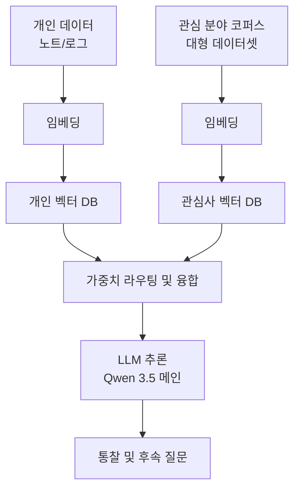

# 🧠 Second Brain
> **내 기록을 기반으로 사고를 확장하고, 나와 대화하는 두 번째 두뇌**
> *Your data, your reflective Second Brain.*

## 📌 프로젝트 개요
**Second Brain**은 사용자의 개인 기록과 관심사 기반 데이터셋을 결합하여
생각을 되묻고, 패턴을 찾아내며, 사고를 확장하도록 돕는 **개인 사고 조력 AI 시스템**입니다.

> 목표는 단순한 정보 제공이 아닌
> **나와 대화하는 또 하나의 두뇌(Second Brain)** 를 만드는 것입니다.

## ✨ 핵심 기능

| 기능 | 설명 |
|---|---|
🧠 Personal RAG | 개인 노트·일기·기록 기반 지식/사고 회상
🌐 Interest RAG | 관심 분야 데이터셋 기반 확장 검색
🎛️ Hybrid Retrieval | 개인/관심사 DB 자동 라우팅 및 스코어 융합
🎭 Persona Cloning | QLoRA 미세 조정을 통한 나의 말투 및 사고방식 복제
💬 Reflection Engine | 통찰 질문 & 사고 확장 대화
🔍 근거 기반 응답 | 문서 기반 근거 인용 (Hallucination 억제)
🔐 Privacy | 개인 데이터 독립 저장 및 보호

## 현재 구현 완료
- **Personal RAG**: `#태그` 및 날짜 메타데이터를 포함한 개인 메모 기반 지식 회상
- **Semantic Search**: `bge-m3` 모델과 `ChromaDB`를 이용한 고성능 로컬 검색
- **Smart Query**: 태그 연관성을 이해하고 출처를 명확히 밝히는 답변 생성
- **Centralized Config**: `config.py`를 통한 시스템 설정 및 보안(Privacy) 관리

## 🧠 왜 필요한가?

- 우리는 **기록은 쌓지만 활용되지 않는다**
- AI는 똑똑하지만 **나를 모른다**
- 자기 성찰/메타인지가 중요하지만 **습관화가 어렵다**

> Second Brain은 기록 → 성찰 → 질문 → 개선
> **지속적인 사고 루프(Self-Improvement Loop)** 를 만든다.

## 🧩 시스템 구조


```mermaid
flowchart TD
    A[개인 데이터<br/>노트/로그] --> B[임베딩]
    C[관심 분야 코퍼스<br/>대형 데이터셋] --> D[임베딩]
    B --> E[개인 벡터 DB]
    D --> F[관심사 벡터 DB]
    E --> G[가중치 라우팅 및 융합]
    F --> G
    G --> H[LLM 추론<br/>Qwen 3.5 메인]
    H --> I[통찰 및 후속 질문]
```

**Multi-Model Architecture**:
- **Main Brain**: Qwen 3.5:9B (추론 및 최종 답변 생성)
- **Persona Specialist**: Llama 3.1 8B (말투/사고방식 미세 조정 학습 전담)
- **Reasoning Specialist**: DeepSeek-R1 (통찰 질문 및 논리 분석)
- **Routing Specialist**: Phi-3 Mini (질문 분류 및 분기 처리)
- **Backup Engine**: Qwen 2.5 7B (시스템 안정성 보조)
- **Embedding**: BAAI/bge-m3 (Local GPU 가속)
- **Vector DB**: Chroma (Local Persistence)

## ⚙️ 실행 방법 (Update)
1. 프로젝트 복제 (Clone)
터미널(또는 CMD)을 열고 프로젝트를 다운로드할 폴더로 이동한 뒤 아래를 입력하세요.
```
git clone https://github.com/imsang27/second-brain.git
cd second-brain
```

2. 가상환경 생성 및 활성화
프로젝트별로 독립된 패키지 환경을 유지하기 위해 권장되는 단계입니다.
```
python -m venv venv
```

가상환경 활성화 (Windows)
```
.\venv\Scripts\activate
```
가상환경 활성화 (Mac/Linux)
```
source venv/bin/activate
```

3. 필수 라이브러리 설치
RTX 4070 및 PyTorch 관련 최적화 라이브러리를 포함한 패키지를 설치합니다.
```
pip install -r requirements.txt
```

4. Ollama 설치 및 모델 다운로드
LLM 엔진인 Ollama가 설치되어 있지 않다면 https://ollama.com 에서 먼저 설치하세요.
설치 후, 터미널에서 아래 명령어로 메인 모델과 임베딩 모델 준비를 돕는 모델을 다운로드합니다.
```
ollama pull qwen3.5:9b
```

5. 환경 변수 설정 (.env)
샘플 파일을 복사하여 실제 설정 파일을 만듭니다.
이후 메모장으로 .env 파일을 열어 NOTES_PATH(내 메모 폴더 경로)를 수정하세요.
Windows
```
copy .env.sample .env
```
Mac/Linux
```
cp .env.sample .env
```

# 6. 지식 베이스 구축 (Ingestion)
내 메모들을 읽어와서 벡터 데이터베이스(ChromaDB)를 생성합니다.
```
python -m src.engine.ingestion
```

# 7. Second Brain 실행 (Query)
이제 구축된 지식을 바탕으로 AI와 대화를 시작합니다.
```
python -m src.engine.query
```

## 📂 데이터 예시

### Personal Document
```json
{
  "source": "obsidian",
  "text": "최근 집중력이 떨어진다. 원인은 수면 부족으로 보인다.",
  "date": "2025-10-31",
  "tags": ["reflection", "productivity"],
  "sentiment": "neutral"
}
```

### Interest Dataset Metadata
```json
{
  "source": "youtube_cc",
  "topic": "machine_learning",
  "tokens": 5800000
}
```

## ⚙️ 기술 스택

| 구성 | 기술 |
|---|---|
LLM | Qwen 3.5, Llama 3.1, DeepSeek-R1, Phi-3
Embedding | bge-m3 / OpenAI
Vector DB | Chroma / FAISS
Framework | FastAPI / Python
Data | Markdown, PDF, YouTube CC
Storage | Local secure namespace

## ✅ 평가 기준

| 항목 | 지표 |
|---|---|
Retrieval | Recall@k, Citation accuracy
Personalization | Personal relevance score
Ablation | Personal vs Interest vs Hybrid 비교
Latency | p95 latency
Reflection Quality | Question depth & coherence

## 🚀 MVP 목표 (1–2주)

- 개인 기록 ingest + 쿼리 가능
- 관심사 데이터셋 구축 및 결합 검색
- 라우팅 전략 + 점수 가중
- **통찰 질문 3개 + 근거 인용 응답** 출력

## 💡 예시 대화

**User:**
요즘 공부 루틴이 계속 깨져. 이유가 뭐지?

**Second Brain:**
최근 기록에서 “피로”와 “목표 과부하” 패턴이 반복됩니다.

**질문:**
- 목표가 너무 큰 건 아닐까?
- 에너지 높은 시간대에 배치할 수 있을까?

**제안:**
오늘은 15분만 시작해봐.

## 📌 핵심 메시지
> Second Brain은 **빅(Big)데이터가 아닌 딥(Deep)데이터**를 다룹니다.
> 세상을 아는 AI가 아니라 **나를 알고 잊지 않는 AI**입니다.

## 📜 라이선스
[Apache-2.0 license](./LICENSE)
